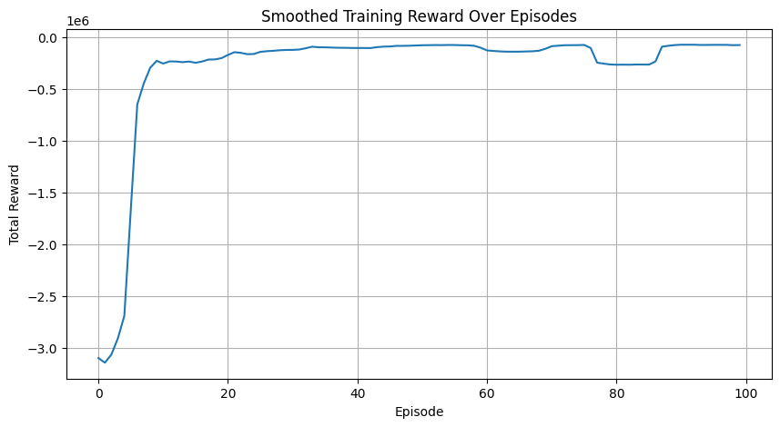

# 📦 RL Inventory Optimization Agent

This is a Streamlit-based web app that trains a **Deep Q-Network (DQN)** agent to manage inventory using historical demand data. The agent learns to place orders to minimize holding, ordering, and stockout costs.

---

## 🚀 Features

- 📊 Loads real sales data (CSV format)
- 🧠 Trains a DQN agent on historical demand
- 📉 Visualizes training rewards
- 🔍 Compares learned policy vs baseline
- 📦 Plots inventory dynamics across days

---

## ⚠️ Dataset Requirement

This app uses `sales_train_validation.csv` from the M5 Forecasting competition.  
The file is **too large for GitHub** (over 100MB) and is not included in this repo.

👉 **Download it here:**  
[Kaggle: M5 Forecasting - Accuracy](https://www.kaggle.com/competitions/m5-forecasting-accuracy/data)

Then place `sales_train_validation.csv` in the same folder as `app.py`.

---

## 📁 File Structure

| File                        | Description                              |
|-----------------------------|------------------------------------------|
| `app.py`                   | Main Streamlit app                       |
| `README.md`                | Project overview                         |
| `requirements.txt`         | Python dependencies                      |
| `.gitignore`               | Git ignored files                        |
| `sales_train_validation.csv` | 🚫 Not included, download from Kaggle   |

---

## ⚙️ Requirements

```bash
pip install -r requirements.txt

streamlit run app.py
